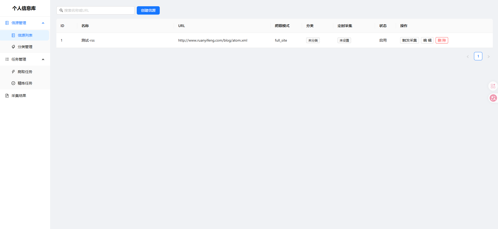

# Personal Information Library

个人信源库 - 自动化信息采集与AI精炼系统

## 项目概述

通过自动化爬取和AI精炼，将分散的网络信息转化为结构化的个人知识库。

**核心价值链**：`信源发现 → 自动采集 → AI精炼 → 结构化入库 → 通知推送 → 可检索复用`

## 已实现功能

- ✅ **整站/RSS/单页爬取**：统一爬取模型，插件化策略，反爬处理
- ✅ **任务系统**：优先级队列、状态机、失败重试、定时调度（cron）
- ✅ **AI精炼**：摘要+关键词+质量评分（0-100），OpenAI兼容接口
- ✅ **分类管理**：独立精炼配置、质量评分标准、预设模板
- ✅ **通知管理**：飞书（消息卡片/文本）/Telegram/Webhook，即时/聚合两种模式
- ✅ **前端界面**：信源、分类、任务、结果、通知渠道全套管理页面

## 技术栈

- **后端**: FastAPI + SQLAlchemy + SQLite
- **任务队列**: asyncio.PriorityQueue + APScheduler
- **爬取引擎**: httpx + BeautifulSoup4
- **AI集成**: OpenAI兼容接口（支持 DeepSeek、本地模型）
- **前端**: React + Vite + Ant Design + TypeScript
- **包管理**: uv (后端) + pnpm (前端)

## 快速开始

### 后端

```bash
cd backend
uv pip install -e ".[dev]"

cp .env.example .env
# 编辑 .env，配置 OPENAI_API_KEY 等

# dev
uv run app/main.py

# prod
uvicorn app.main:app --reload
```

访问 http://localhost:8000/docs 查看 API 文档

### 前端

```bash
cd frontend
pnpm install
pnpm dev
```

## 项目结构

```
Personal-Information-Library/
├── backend/app/
│   ├── api/               # REST API（sources, categories, tasks, results, refine, notification_channels, notification_rules）
│   ├── core/              # 核心引擎（crawler, refiner, scheduler, notifier）
│   │   └── notifiers/     # 通知插件（webhook, telegram, feishu）
│   ├── models/            # 数据模型（9张表）
│   ├── plugins/           # 爬取插件（generic, rss）
│   └── schemas/           # Pydantic 校验模型
├── frontend/src/
│   ├── api/               # API 客户端
│   └── pages/             # 页面组件
└── docs/                  # 架构文档 + PRD
```

## 功能截图





## TODO

- [ ] 通知日志页面（查看历史发送记录）
- [ ] 采集异常通知（任务连续失败触发告警）
- [ ] 结果全文搜索（SQLite FTS5）
- [ ] 兴趣图谱：用户反馈驱动的个性化推荐

## 文档

- [产品需求文档](docs/PRD.md)
- [技术架构设计](docs/architecture.md)

## License

MIT
