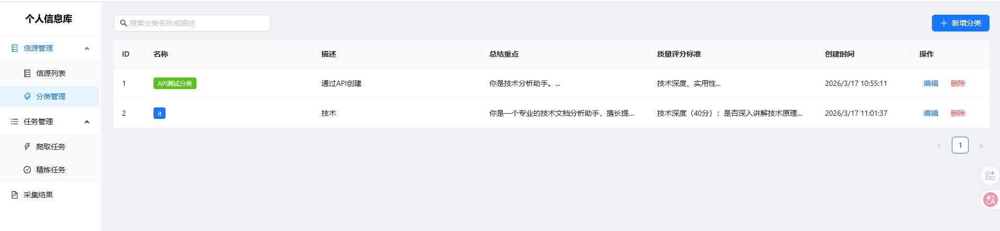
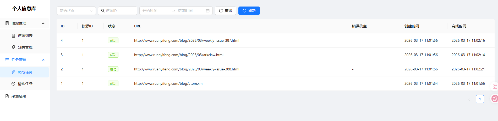
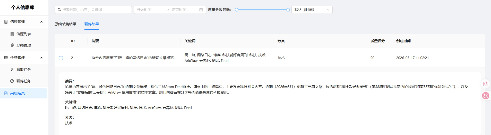
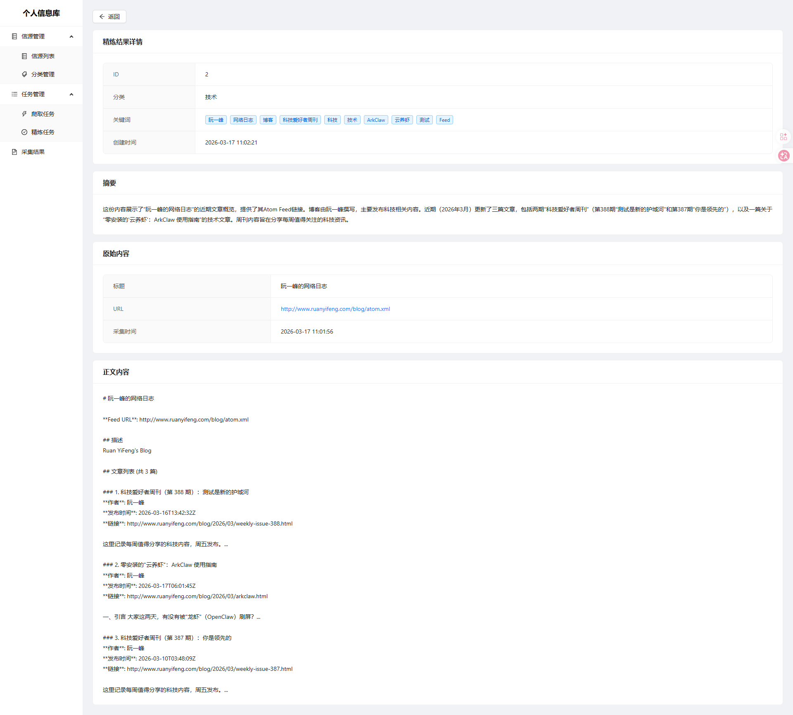

# Personal Information Library

个人信源库 - 自动化信息采集与AI精炼系统

## 项目概述

通过自动化爬取和AI精炼，将分散的网络信息转化为结构化的个人知识库。

**核心价值链**：`信源发现 → 自动采集 → AI精炼 → 结构化入库 → 可检索复用`

## MVP功能

- ✅ **整站爬取**：入口页 → 子页面列表 → 递归爬取
- ✅ **任务系统**：优先级队列、状态机、失败重试
- ✅ **插件框架**：可扩展的爬取策略
- ✅ **AI精炼**：摘要+关键词提取
- ✅ **基础UI**：任务列表 + 结果预览

## 技术栈

- **后端**: FastAPI + SQLAlchemy + SQLite
- **任务队列**: asyncio.Queue + APScheduler
- **爬取引擎**: httpx + BeautifulSoup4 + Playwright
- **AI集成**: OpenAI兼容接口
- **前端**: React + Vite + Ant Design
- **包管理**: uv (后端) + pnpm (前端)

## 快速开始

### 后端

```bash
cd backend
python3 -m venv .venv
source .venv/bin/activate
pip install uv
uv pip install -e ".[dev]"

# 配置环境变量
cp .env.example .env
# 编辑 .env，配置 OPENAI_API_KEY

# 运行服务
uvicorn app.main:app --reload
```

访问 http://localhost:8000/docs 查看API文档

### 前端

```bash
cd frontend
pnpm install
pnpm dev
```

## 项目结构

```
Personal-Information-Library/
├── backend/                    # FastAPI 后端
│   ├── app/
│   │   ├── api/               # REST API（sources, categories, tasks, results, refine）
│   │   ├── core/              # 核心引擎（crawler, refiner, scheduler）
│   │   ├── models/            # 数据模型（Source, Category, Task, CrawlResult, RefinedResult）
│   │   ├── plugins/           # 爬取插件（generic, rss）
│   │   └── schemas/           # Pydantic 校验模型
│   └── tests/
├── frontend/                   # React + TypeScript 前端
│   └── src/
│       ├── api/               # API 客户端
│       └── pages/             # 页面组件（SourceList, CategoryList, TaskList, ResultDetail）
├── docs/                       # 项目文档
│   └── plans/                 # 设计方案与调研
└── README.md
```

## 开发状态

### ✅ Week 1 - 核心基础设施（已完成）
- [x] 后端骨架 + 数据模型（6张表）
- [x] 插件框架基础
- [x] 任务系统实现
- [x] 基础API端点
- [x] 50个测试用例通过

### ✅ Week 2 - 调度优化与反爬（已完成）
- [x] APScheduler集成（定时任务）
- [x] 整站爬取优化（循环检测 + URL过滤）
- [x] 反爬处理（UA轮换 + 限速 + 并发控制）

### ✅ Week 3 - AI精炼引擎（已完成）
- [x] OpenAI兼容接口集成
- [x] 自动精炼流程
- [x] 精炼API（手动触发 + 模板管理 + 预览）

### ✅ Week 4 - React前端（已完成）
- [x] React + TypeScript + Vite
- [x] Ant Design UI
- [x] 信源管理、任务列表、结果详情页面

### ✅ Week 5 - 分类管理增强（已完成）
- [x] 分类 CRUD（名称、描述、颜色标签）
- [x] 结构化精炼配置（总结重点 + 质量评分标准）
- [x] 预设模板（技术文档、投资资讯、阅读笔记）
- [x] 质量评分体系（0-100 分，精炼时自动评分）
- [x] 结果筛选排序（质量分数滑块、多维排序）
- [x] 信源-分类关联（信源绑定分类，继承精炼配置）
- [x] 菜单结构优化（信源管理父菜单 + 子菜单）

## 功能展示

### 信源管理菜单



### 分类管理页面


### 分类编辑表单



### 采集结果与质量评分





## 分类管理

分类管理为信源提供结构化的精炼配置，不同分类可以定义不同的 AI 精炼策略和质量评判标准。

### 核心特性

**结构化精炼配置**
- 每个分类可配置独立的「总结重点」（作为 AI 系统提示词）和「质量评分标准」
- 信源绑定分类后，精炼时自动使用分类的配置，无需逐个信源配置

**质量评分体系**
- 精炼结果自动生成 0-100 质量评分
- 评分标准由分类的 `quality_criteria` 定义，支持自定义评判维度
- 采集结果页支持按质量分数区间筛选、按评分排序

**预设模板**
- 内置 3 套模板：技术文档、投资资讯、阅读笔记
- 一键应用模板，自动填充总结重点和质量评分标准
- 可在模板基础上自定义修改

### 使用流程

1. 进入「信源管理 → 分类管理」创建分类，配置精炼策略
2. 在「信源列表」中为信源选择所属分类
3. 触发爬取和精炼后，系统自动使用分类配置进行 AI 精炼并评分
4. 在「采集结果」页面通过质量分数滑块筛选高质量内容

## TODO

- [ ] 通知管理：Webhook/Telegram 通知推送（[调研文档](docs/plans/2026-03-17-notification-management-research.md)）
- [ ] 兴趣图谱：用户反馈驱动的个性化推荐
- [ ] 详细设计见：[分类管理+通知管理+兴趣图谱设计方案](docs/plans/2026-03-13-category-notification-interest-design.md)

## 文档

- [技术架构设计](docs/architecture.md)
- [测试计划](docs/test-plan.md)
- [产品需求文档](docs/PRD.md)
- [项目总结](docs/project-summary.md)
- [Tmux 使用指南](docs/tmux-guide.md)
- [分类增强设计方案](docs/plans/2026-03-17-category-enhancement-design.md)
- [通知管理调研](docs/plans/2026-03-17-notification-management-research.md)

## License

MIT
